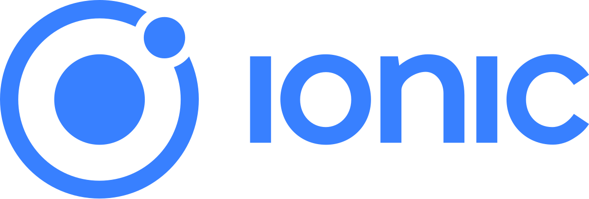
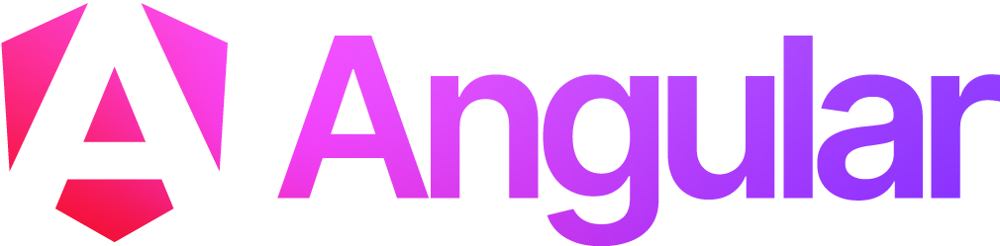
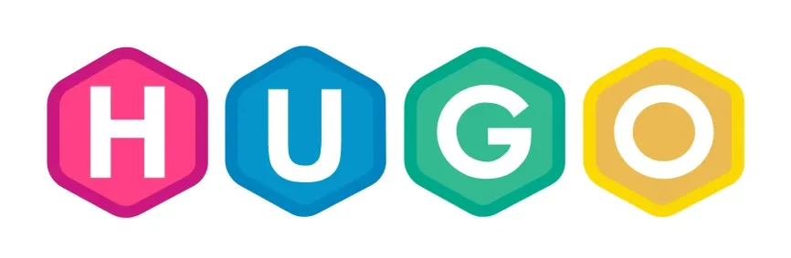

### A Tech Writer Who Cosplays as a Developer

Hello, visitor! I'm David Castro, a technical writer at Google. You can see the work that I do for the [Protocol Buffers](https://protobuf.dev) project in the [documentation repository](https://github.com/protocolbuffers/protocolbuffers.github.io). While I love teaching people about protos, my more interesting repositories center around my five years as a [FIRST Robotics Competition](https://firstinspires.org/frc) mentor.

#### FIRST Robotics Competition

FIRST Robotics Competition (FRC) is an annual competition for high school students. They build a robot that needs to be able to perform certain tasks, like shooting a ball into a target or stacking crates. When the robots compete, they're put into "alliances," which are teams that have three robots that all work together to beat the opposing alliance's three robots. Each match has a different mix of teams, so someone may be on your alliance one match, and then on the opposing alliance in the next match.

After the qualification matches, the highest-ranking teams have to choose alliance partners to join them for the playoff matches. The decisions made with these selections can make or break an alliance's chances of winning. They need to choose from the available teams those that have the most complementary skills and abilities. To do this, they need to collect data about each team at the competition. To do this, they do "scouting" during the qualifying matches.

That's where the subteams that I mentored came in. Each year, we would build a new mobile app from scratch. The apps were tailored to the tasks that were performed in each year's competition (which change from year to year). I had between two and five students working with me the three years that we created scouting apps.

We created [cat5scouting](https://github.com/Logofile/Cat5Scouting) the first year that we made an app. We stored the data in LocalStorage and exported the data to CSV files that we would then load onto a USB drive and have one dedicated student smoosh into a single spreadsheet. That was pretty miserable for that student, so we aimed to make things a little better the next year.

[The Hindenburg](https://github.com/Logofile/TheHindenburg) was our second app. The name was fitting for that year, which had a steampunk theme. This year, we switched to using a SQLite database for the data. As I recall, the export was able to append data to an existing database, which made life a lot easier for our strategy team members. It still involved physically running database files from the stands back to the pit for the strategy team to pore over the data, so we aimed to make things a little better the next year.

[RoboRecon](https://github.com/Logofile/RoboRecon) was our third app. This year, we used a Firebase data store for the data. This enabled the data to travel over the internet to the pit, which made for much less-sweaty robotics students! Because running hotspots in the stands was against the rules, we had to use internet over Bluetooth connections with various team members' cell phones. That was very flaky, but we still managed to make it work.

All three of these apps used the [Ionic Framework](https://ionicframework.com/) to enable us to generate both an Android and iOS version of the app. The students did some of the; I did more than I would have liked. It's hard to get students who have never porgrammed before up-to-speed on JavaScript, Ionic, SQL or Firebase, and the other underlying technologies in the span of a month and a half!

#### Masters Degree in Software Engineering

In addition to mentoring and working at Google, I've spent the last few years pursuing an [MSSWE at Kennesaw State University](https://www.kennesaw.edu/degrees-programs/master-degrees/software-engineering.php). I've had various repositories on my account during that time, but tend to delete them after the semester ends. (I should probably stop doing that.)

My projected graduation date is May, 2026.

### Technologies

Over the years, I've used various frameworks, languages, tools, and libraries. The following are a few of the more-recent that I used more heavily than others.

&nbsp;&nbsp;&nbsp;&nbsp;&nbsp;&nbsp;&nbsp;&nbsp;&nbsp;&nbsp;